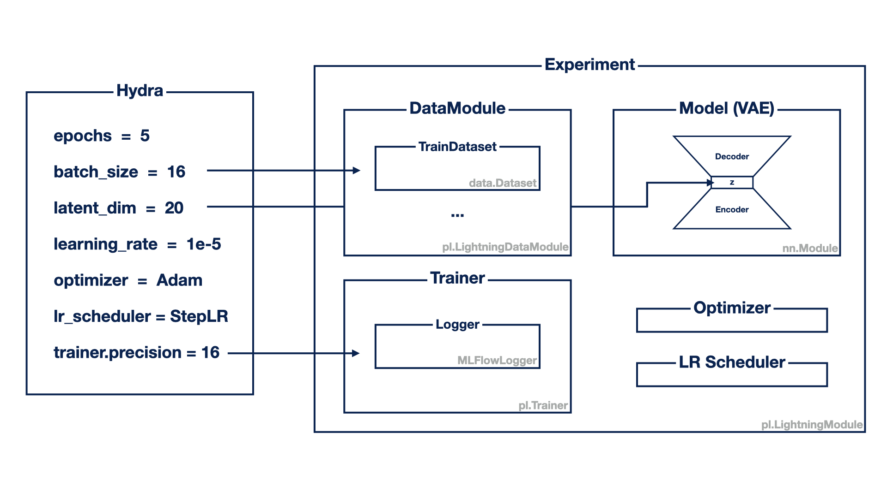

# Template Pytorch-Lightning Hydra Mlflow Poetry


The code in this repository is based on [pytorch/examples](https://github.com/pytorch/examples/blob/2639cf050493df9d3cbf065d45e6025733add0f4/vae/main.py).


## Template Design



Configurations written in `yaml` are in `configs` directory.
You can easily overwrite these configurations through command line arguments.


## Instllation

```bash
poetry install
```

## Run Training

```bash
# single run with default settings
poetry run python main.py
# single run
poetry run python main.py gpus=[0,1,2,3] batch_size=128 trainer.accelerator=ddp trainer.precision=16 optimizer=sgd scheduler.step_size=1
# multi runs
poetry run python main.py -m optimizer=adam,rmsprop,sgd trainer.precision=16,32 scheduler.step_size=1
```

## Start Mlflow Server

```bash
poetry run mlflow ui
# access http://127.0.0.1:5000
```


## Run Formatter

```bash
poetry run pysen run format
```